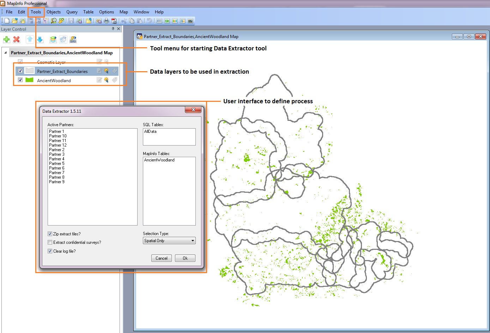
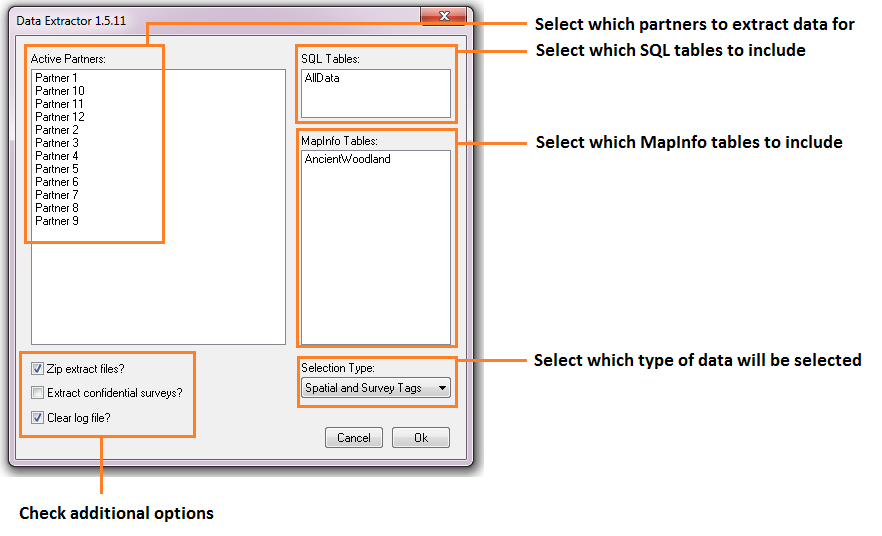
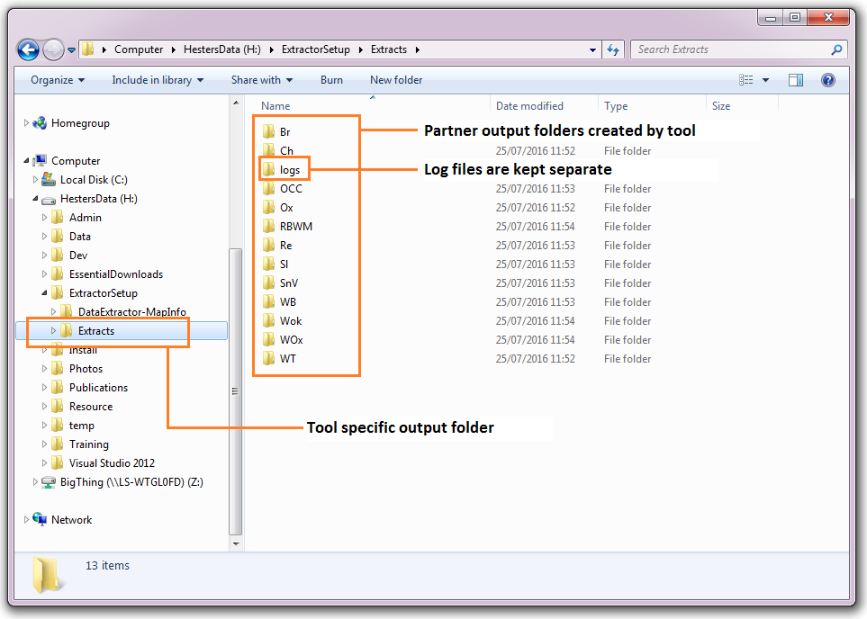
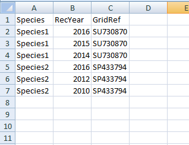
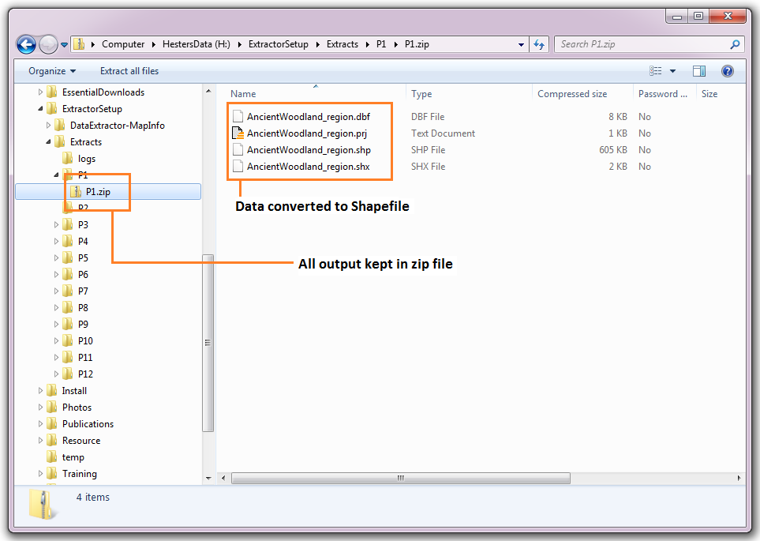
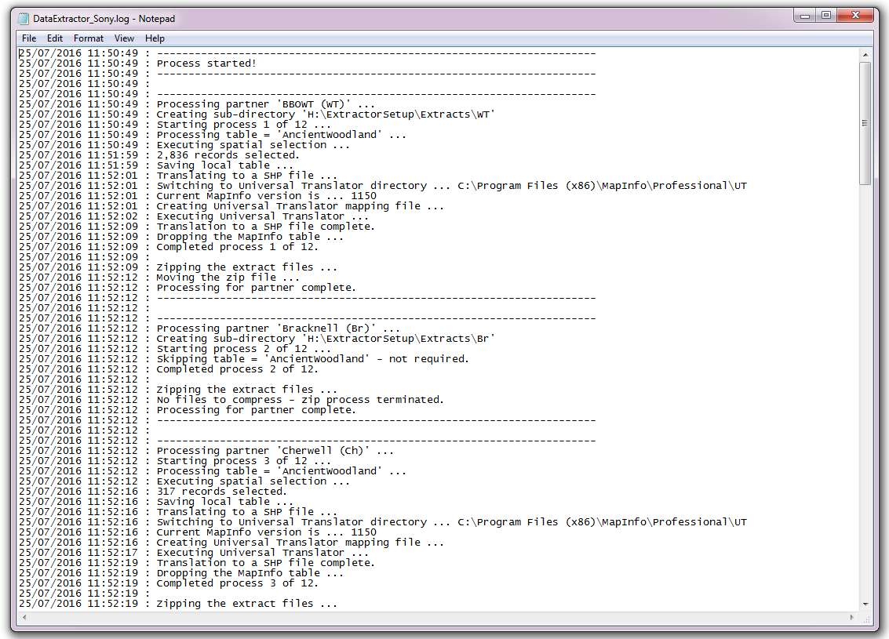

**************************
Anatomy of data extraction
**************************

.. index::
	single: Detailed process description

This section describes how a typical data extraction might be carried out manually, and how the Data Extraction Tool automates this process. Please note that the examples used in this illustration are purely fictional and do not represent a real-world scenario. 

Detailed process description
============================

The process of a typical data extraction can be broken down into a number of distinct steps that are described here. In the next section the way that the Data Extraction Tool carries out these steps is explained.

**Defining a search boundary**

Before any extraction can be carried out, the polygon describing the area for which data will be extracted has to be entered into the GIS system. Typically this would be held in a single data layer, with some associated attributes such as the name of the organisation represented by the boundary. Once this area has been entered into the data layer, it can be used time and again.

**Selecting the relevant data layers**

Using the boundary defined and/or selected in the previous step, each of the data layers describing the presence of protected sites and/or species is selected one by one. Where data is held within SQL Server, this process may need to be carried out within the SQL Server management suite. 

**Exporting the results**

The selected features are exported in the format required by the user, including only the relevant columns from the dataset. Symbology may be defined by hand before the data is ready to be sent out. 

**Repeating the process**

Where there is more than one partner for which data needs to be extracted, the process will be repeated for each partner boundary.

.. index::
	single: Tool overview

The Data Extractor Tool
======================

There are four parts to the Data Extractor Tool that work together to automate the process described above:

1. A GIS layer that describes the boundaries of all relevant partners and stakeholders. This is held both within the GIS system and within SQL Server.
#. Spatial data held in an SQL database, and / or in spatial data layers within the GIS system. Where data is held within SQL Server, a stored procedure for its extraction is also required.
#. An XML file that specifies how the extractions are set up and what data should be exported for each data layer
#. The Data Extractor Tool interface.

The Data Extractor Tool is used within a GIS environment and requires all the required data layers to be preloaded in the GIS (see :numref:`figMapInfoUI`). Where data is to be extracted from SQL Server, a boundary dataset is also required within the SQL Server database.

.. _figMapInfoUI:

	The MapInfo user interface configured for using the Data Extractor Tool

Tool workflow
-------------

The Data Extractor Tool requires minimum user input in order to carry out its processes once it is configured. The simple workflow is as follows (see :numref:`figUIAnn`):

1. The user selects for which partner(s) the extraction should be carried out.
#. The user specifies which data layers to search. Only layers that are loaded in the GIS or are available in the SQL database are made available at this point. 
#. The users selects whether the extracted files should be added to a zip file, whether confidential data should be included, and whether the log file should be cleared before the process starts.
#. Finally, the user selects whether the selection of data should be based on spatial location only, survey tags (names) only, or both. This allows for the inclusion of data relevant to a stakeholder that is outside of a stakeholder's boundary.
#. Once the user clicks 'OK' the process starts.

.. _figUIAnn:

	The Data Extractor Tool menu workflow

In essence, the process that the tool follows is identical to the manual extraction described above. 

1. The boundary of each partner is processed in sequence. 
#. The relevant SQL and GIS data layer are selected using the boundary (and/or the survey tags) for this partner.
#. The resulting selections are exported to the output folder as specified in the configuration file, using the columns and symbology specified in this configuration file.
#. During the process the tool reports its progress to a log file and when the process finishes this log file is displayed, allowing the user to assess the success of the data extraction. The log file is kept with the other output in the output directory.

.. index::
	single: Tool Outputs

Tool Outputs
============

Below is a selection of outputs generated from an example data extraction using the data given in figure :numref:`figMapInfoUI`. The extraction was carried out for all partners shown in the menu. 

The tool output is stored in a user defined folder (:numref:`figOutputFolder`). These outputs may include a combination of GIS layers, tabular layers in different formats and the log file.

.. _figOutputFolder:

	Data Extractor Tool output folder

Tabular output is produced in CSV format (:numref:`figTabularOutput`). 

.. _figTabularOutput:

	Example of tabular output from the Data Extractor Tool TO BE CREATED

Options in the tool include compressing all output into a single zip file for each partner, and the conversion of GIS data between MapInfo and ArcGIS formats (:numref:`figOutputOptions`).

.. _figOutputOptions:

Finally, the log file details each step that was taken during the process, and gives some feedback about the outcomes of the steps. This includes reporting on the input for the search, the number of features that were selected in each data layer, and which data layers did not return any features (see :numref:`figLogFileExample`).

.. _figLogFileExample:

	Example of a Data Extractor Tool log file

The following chapters, :doc:`setting up the tool <../setup/setup>` and :doc:`running the tool <../execute/execute>`, will guide you through setting up and operating the tool in such a way that these tool outputs meet the exact requirements of data extraction within your organisation.