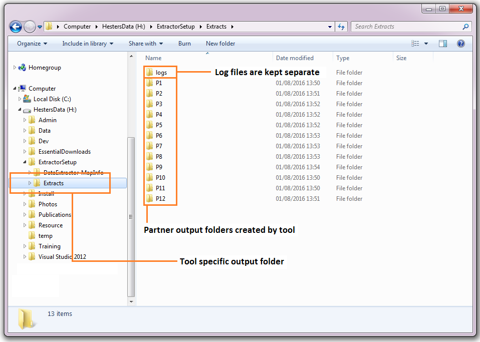

**************************
Anatomy of data extraction
**************************

.. index::
	single: Data extract process

This section describes how a typical data extraction might be carried out manually, and how the DataExtract Tool automates this process. Please note that the examples used in this illustration are purely fictional and do not represent a real-world scenario. 

Data extraction process
=======================

The process of a typical data extraction can be broken down into a number of distinct steps that are described here. In the next section the way that the DataExtractor Tool carries out these steps is explained.

Defining a partner boundary
	Before any extraction can be carried out, a polygon describing the area for which data will be extracted for a partner has to be defined. This would be held in a single GIS layer together with some associated attributes such as the name of the organisation represented by the boundary. Once this area has been entered into the GIS layer it can be used time and again.

Selecting the relevant data layers
	Using the boundary defined in the previous step, each of the data layers relating to the presence of protected sites, habitats, species, etc. is selected one by one. Where data is held within SQL Server this process is carried out within the SQL Server database.

Exporting the results
	The selected features are extracted in the format required by the user, containing only the relevant columns required from each data layer. Symbology may also need to be applied at this step.

Repeating the process
	Where there is more than one partner for which data needs to be extracted, the whole process will be repeated for each partner boundary.

.. raw:: latex

   \newpage

.. index::
	single: Tool overview

The DataExtractor tool
=======================

Tool components
---------------

There are four component parts to the DataExtractor tool that work together to automate the process described above:

1. A GIS layer that describes the boundaries of all relevant partners and stakeholders. This is held both within the GIS application and within SQL Server.
#. Spatial data held in an SQL database and / or in spatial data layers within the GIS application. Where data is held within SQL Server a stored procedure for its extraction is also required.
#. An XML configuration file that specifies how the extracts are set up and what data should be exported for each data layer.
#. The DataExtractor tool itself.

The DataExtractor tool is used within a GIS application and requires all the required GIS layers to be preloaded in the GIS (see :numref:`figMapInfoUI`). Where data is to be extracted from SQL Server the partner boundary layer must also be preloaded into the SQL Server database.

.. _figMapInfoUI:

.. figure:: figures/InterfaceMapInfoAnnotated.png
	:align: center

	A MapInfo workspace configured for using the DataExtractor tool

.. raw:: latex

   \newpage

Tool workflow
-------------

The DataExtractor tool requires minimum user input in order to carry out its processes once it is configured. The simple workflow is as follows (see :numref:`figUIAnn`):

1. The user selects which partner(s) and/or stakeholders the extraction should be carried out.
#. The user specifies which data layers to extract from. Only layers that are loaded in the GIS or tables found in the SQL Server database are made available at this point.
#. The user selects whether the extracted files should be compressed in a zip file once complete, whether any records should be excluded from the SQL Server table, and whether the log file should be cleared before the process starts.
#. Finally, the user selects whether the selection of SQL Server data should be based on spatial location only, survey tags only, or both. This allows for the inclusion of data relevant to a partner that is outside of that partner's boundary.
#. Once the user clicks **OK** the process starts.

.. _figUIAnn:

	The DataExtractor tool workflow

In essence, the process that the tool follows is identical to the manual process a user would perform:

1. The boundary of each selected partner is processed in sequence. 
#. The specified SQL Server and GIS data layers are selected using the boundary (and/or the survey tags) for this partner.
#. The resulting selections are exported to the output folder as specified in the configuration file, using the attribute columns and symbology specified in this configuration file.
#. During the process the tool outputs its progress to a log file and, when the process finishes, this log file is displayed allowing the user to assess the success of the data extraction.

.. raw:: latex

   \newpage

.. index::
	single: Tool outputs

Tool outputs
============

Below is a selection of outputs generated from an example data extraction using the data selections shown in figure :numref:`figMapInfoUI`. The extraction was carried out for all partners shown in the user interface. 

Output folder
-------------

The outputs are stored in a user-defined folder (:numref:`figOutputFolder`). These outputs may include a combination of GIS layers and text files in different formats, as well as the log file.

.. _figOutputFolder:

	Example of the DataExtractor tool output folder

.. raw:: latex

   \newpage

Output files
------------

Text file outputs can be produced in CSV or TXT format (:numref:`figTabularOutput`). GIS layers can be output in MapInfo (.tab) format and/or ArcGIS (.shp) format (for MapInfo users) or ArcGIS (.shp) format (for ArcGIS users).

.. _figTabularOutput:

.. figure:: figures/ExampleTabularOutput.png
	:align: center

	Example of a text file output from the DataExtractor tool

.. raw:: latex

   \newpage

Output options
--------------

Options in the tool include compressing all outputs into a single zip file for each partner (:numref:`figOutputOptions`; MapInfo only), including confidential records (defined in the configuration document) in any SQL table extracts, and clearing the log file before use.

.. _figOutputOptions:

.. figure:: figures/OutputOptionsAnnotated.png
	:align: center

	Example of a compressed output file containing a single GIS layer (MapInfo)

.. raw:: latex

   \newpage

Finally, the log file details each step that was taken during the process, and gives some feedback about the outcomes of the steps. This includes reporting on the input for the search, the number of features that were selected in each data layer, and which data layers did not return any features (:numref:`figLogFileExample`).

.. _figLogFileExample:

.. figure:: figures/LogFileExample.png
	:align: center

	Example of a DataExtractor tool log file

The following chapters, :doc:`setting up the tool <../setup/setup>` and :doc:`running the tool <../execute/execute>`, will guide you through setting up and operating the tool in such a way that these tool outputs meet the exact requirements of data extraction within your organisation.
