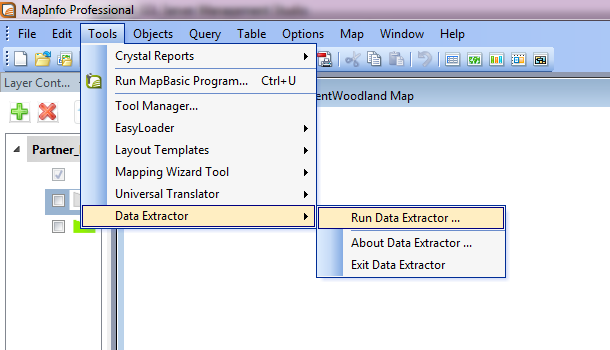
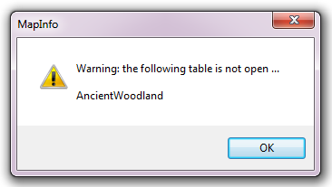
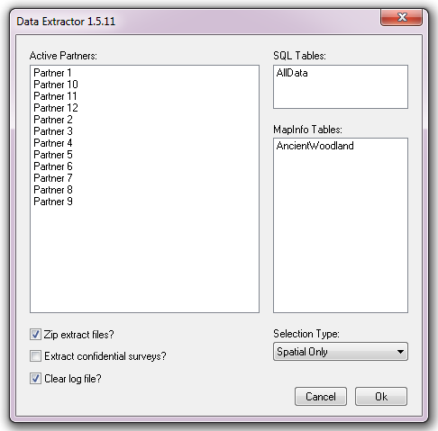
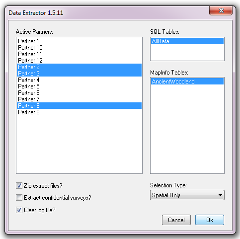
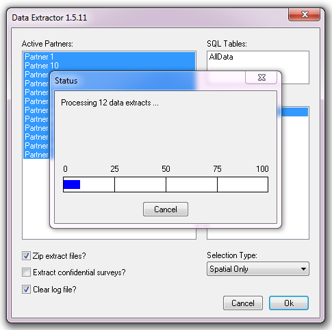
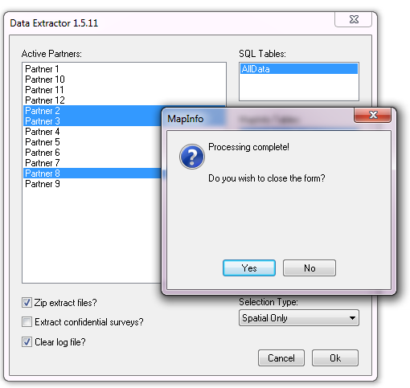
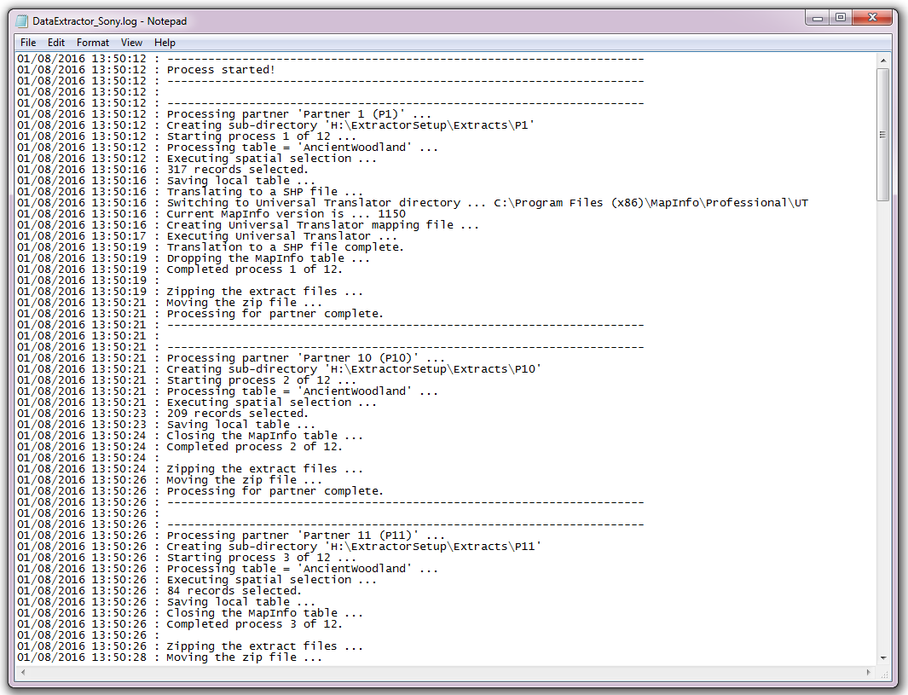
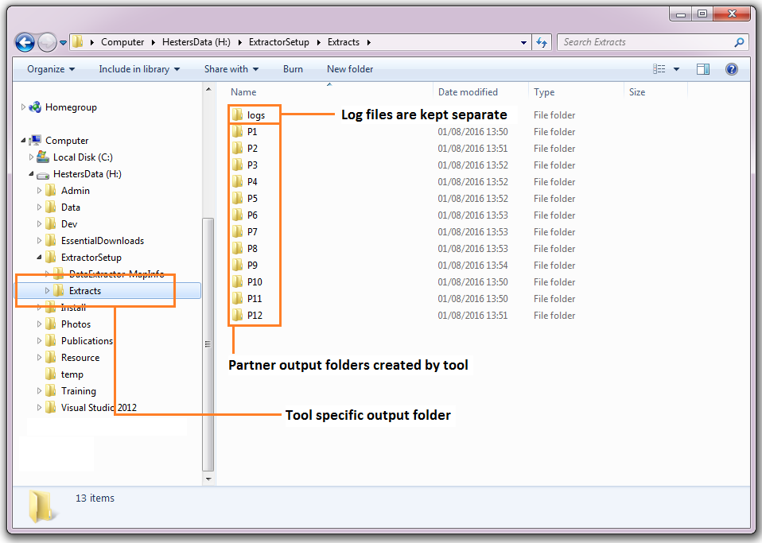

.. index::
	single: Running the tool

****************
Running the tool
****************

As discussed in the :doc:`Setting up the tool <../setup/setup>` section, the Data Extractor tool is operated from a MapInfo workspace within which the GIS layers required to run the tool is already loaded. It also relies on an SQL database containing the boundaries of the relevant partners, the SQL tables containing any data that may be extracted, and a configuration document for setting up the tool. Therefore, before running the tool, ensure the following conditions are met:

- A MapInfo document has been created which contains both the partner boundary GIS layer and any MapInfo GIS layers that may be included in the extraction. 
- An SQL database exists that contains the relevant partner boundaries, any data tables required, and the auxiliary tables and stored procedures as set out in the setup section. 
- The file dsn for the SQL database has been created.
- The XML configuration document has been set up correctly, both for general settings and for each individual layer that will be queried. It is also named correctly and in the same directory as the tool MapBasic application (.MBX).
- The Data Extractor tool has been installed and is loaded in MapInfo using the MapInfo Tool Manager.

.. seealso::
	Please refer to the :doc:`setup <../setup/setup>` section for further information about any of these requirements.

.. raw:: latex

   \newpage

.. index::
	single: Opening the form

Opening the form
================

To open the Data Extractor tool, open the tool in the `Tools` menu (**Tools... -> Data Extractor**), as shown in :numref:`figRunExtractor`. 

.. _figRunExtractor:

	Launching the Data Extractor tool (MapInfo)

If there are any structural issues with the XML document, the tool will display a message that it has encountered an error, and not load any further. If any of the map layers that are listed in the configuration document are not present in the active workspace a warning will be shown (:numref:`figLaunchWarning`). The layers that are missing will not be loaded into the form and so cannot be included in the extracts.

.. _figLaunchWarning:

	Example warning message when any GIS layers are not found

.. raw:: latex

   \newpage

Provided that the XML document is otherwise correct, the form will display (:numref:`figDisplayForm`).

.. _figDisplayform:

	The form displaying the active partners and available data layers

.. raw:: latex

   \newpage

.. index::
	single: Using the form

Using the form
==============

The form can be used to process as many partners and tables as required during a single execution. Select the partners for which you wish to run the extraction, and the SQL and / or MapInfo tables that you would like to include, what type of SQL table extraction you would like to carry out (spatial, survey tags, or both), make sure all other options are correct then press **OK**.

.. _figSelectOptions:

	Select the required options on the form

.. caution::
	The tool can run for a considerable amount of time dependent on the number of records that are being selected.

.. raw:: latex

   \newpage

Progress is shown in a progress window (:numref:`figProgress`).

.. _figProgress:

	Progress window during the extract process

.. raw:: latex

   \newpage

When the extract process finishes it asks the user whether to close the form or keep it open for subsequent use (:numref:`figFinished`).

.. _figFinished:

	Prompt to close form when extract process completes

.. raw:: latex

   \newpage

Once the user makes a choice the log file is shown (:numref:`figLogFile`). This should be checked thoroughly to ensure that all expected extracts have been generated, the format of the extract files is correct, and that the number of records included in each extract file is as expected.

.. _figLogFile:

	Example log file shown for review

You can now repeat the extract process for different partners and /or files as required.

.. raw:: latex

   \newpage

.. index::
	single: Extraction results

Extract results
===============

All results are output to the `DefaultPath <../setup/setup.html#defaultpath>`_ folder as specified in the XML configuration document. As shown in :numref:`figResults` each partner has its own sub-folder where the extract files for that partner are stored in the formats specified in the partner GIS layer.

.. _figResults:

	Outputs are organised in partner-specific folders

The log file results of the process is saved in the `LogFilePath <../setup/setup.html#logfilepath>`_ folder as specified in the XML configuration document.
