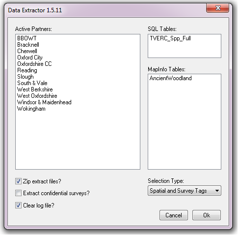

************
Introduction
************

.. index::
	single: Background

Background
==========

Carrying out data extractions (i.e. extracting records for stakeholders on, for example, species or local nature reserves) is a routine task for Local Environmental Record Centres (LERCs). The process is a repetitive one, with the same kind of extraction being carried out for what can be a considerable number of stakeholders. Mostly, the only difference between stakeholders is the geographical area they focus on, while the data they require can be represented by a few standard tables. Therefore this is a process that is ideally suited to being automated.

The Data Extractor Tool was originally developed for Greenspace Information for Greater London (GiGL) and implemented in MapInfo. Currently the tool is used by a variety of LERCs and a version for ArcGIS is under consideration.

.. index::
	single: Tool overview

Tool overview
=============

The Data Extractor Tool presents a simple user interface, while being configurable in a flexible way according to the requirements of the LERC or individual user. It is integrated into the user interface of the GIS system and presented there as menu item. The tool itself has a simple interface (:numref:`figUI`), requiring a minimum of input (the user is requested to select which partners an extract will be created for, and from which tables. There are some additional options to tailor the extracts to include confidential records, and some simple output options). 

.. _figUI:

	the Data Extractor Tool menu

Data layers for the tool can be contained in an SQL Express database, or as GIS layers in the interface. When running an extraction, the tool uses a preloaded GIS layer in the interface, as well as in the associated SQL database, to find the boundary for each partner, and then extracts only the records which intersect with this boundary. The attributes in the GIS layer for each partner define which of the available data layers will be extracted. Extracts are saved in a predefined location, and a log file is kept that records the steps of each search. The process is discussed in this document in more detail in the section on :doc:`using the tool <../execute/execute>`.

Defining the way that extractions should be carried out, the output that they generate, and the layers that can potentially be included is done via a configuration document written in XML. Using this document the user can configure all the parts of the extraction, for example:

* The name of the geographic layer containing the partner boundaries, and its key columns.
* The location of the SQL server file DNS.
* The location of the output folder.
* For each data layer, a detailed definition of what information should be returned from it.
* Details on the display and labelling of output from individual data layers where relevant.

Using this configuration file, each individual LERC can tailor the Data Extractor Tool to its individual requirements. Examples of the XML file are included in the :doc:`../appendix/appendix`, and the process of setting up this file is discussed in the section on :doc:`setting up the tool <../setup/setup>`. 

.. index::
	single: Benefits

Benefits
========

There are a number of clear benefits to using the Data Extractor Tool for carrying out routine data extractions for stakeholders. 

1. The tool, by encapsulating and automating the process, saves considerable time over carrying out these extractions manually.
#. Both the process and the outputs of the extraction are standardised, therefore minimising the risk of user error that is present in a manual extraction.
#. By specifying the outputs of the tool centrally through the configuration file, the output for each extraction is consistent with all other extractions, regardless of the individual carrying out the extraction. This leads to comparability of results and a predictable experience for the users of a data extraction service.
#. The extractions are repeatable and, through the inclusion of the log file, automatically documented.