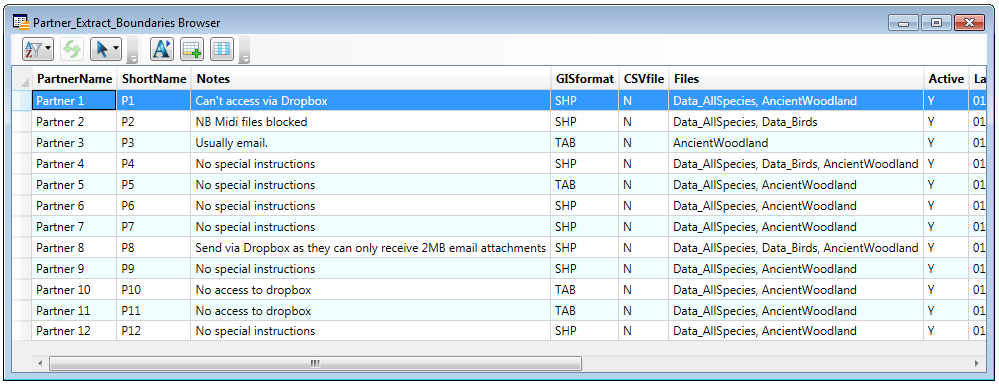
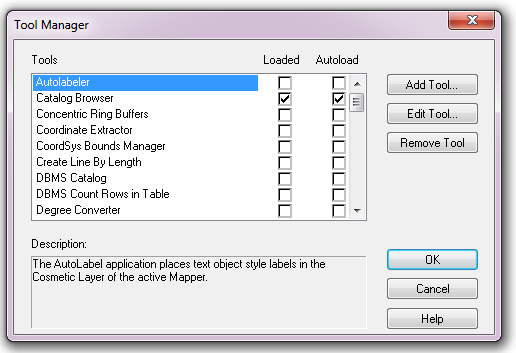
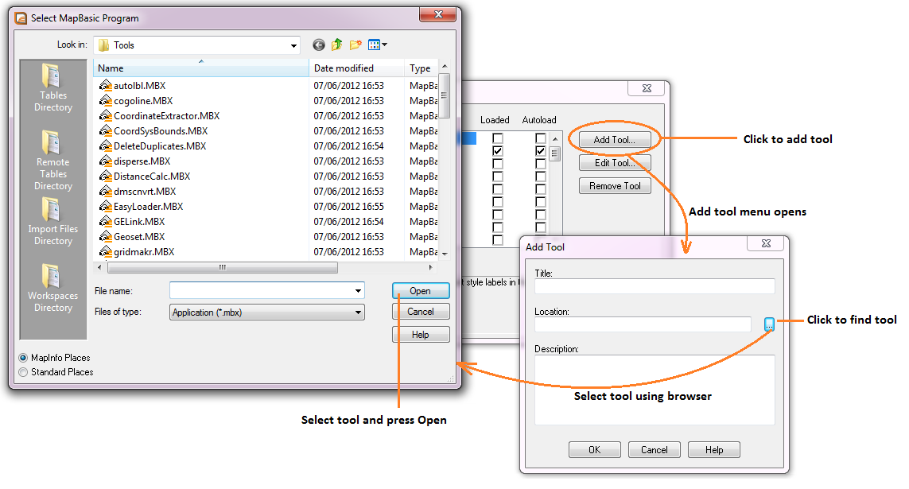
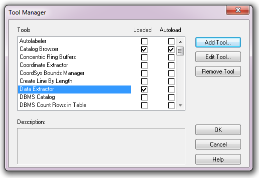

*******************
Setting up the tool
*******************

Before the Data Extractor Tool will function, it needs to be installed and configured. It is recommended that the configuration is carried out first.

.. note::
	It is recommended that a MapInfo Workspace is created that contains all the required data to run the tool, and that the tool is loaded into that. Once this workspace has been set up and the tool has been configured as described below, running the Data Extractor tool becomes a simple process.

.. index::
	single: Configuring the tool

Configuring the tool
====================

The configuration is stored in an XML file called 'DataExtractor.xml', an example of which can be found in the :doc:`appendix <../appendix/appendix>`. Attributes and settings are presented as nodes (beginning with a start node, e.g. ``<example>``, and finishing with an end note, e.g. ``<\example>``), with the value for the setting held between the ``<value>`` and ``<\value>`` tag. 

.. note:: 
	The name of the configuration file must be 'DataExtractor.xml'. The tool will not load if a different name is used.

The XML file can be edited in a text editor such as Notepad or Wordpad, or using a more feature rich XML editor such as as `Sublime Text <https://www.sublimetext.com/3>`_. The configuration file is split into three sections: a section containing general attributes of the searches, and a section that deals with the way each data layer should be handled, split into SQL Server layers and MapInfo layers. 

.. note::
	It is important that the structure of the file is maintained as it is presented in the :doc:`appendix <../appendix/appendix>`. Any changes to the structure may result in the Data Extractor Tool not loading, or not working as expected.

Once editing has been completed and the edits have been saved, it is recommended that the configuration file is opened using an internet browser such as Internet Explorer which will help highlight any editing errors – only if the structure of the file is valid will the whole file be displayed in the internet browser.

.. note::
	It is recommended that the configuration file is kept in a central (network) location, so that all data searches use the same setup. Additionally, it is essential that the configuration file is kept in the same folder as the compiled version of the tool.

.. index::
	single: Setting up the XML file

Setting up the XML file
-----------------------

.. index::
	single: General attributes

**General attributes**

The first section of the configuration file deals with a series of general attributes for the Data Extractor tool. These general nodes specify where files are kept, how output files should be named and other overall settings. Details on these attributes and their expected values are given below. The list follows the order within which the attributes are found in the configuration file. This version of the configuration details is valid for version 1.5.11 of the Data Extractor Tool.

_`LogFilePath` 	
	The folder to be used for storing log files. This folder must already exist.

_`FileDSN`
	The location of the file DSN which specifies the connection to the SQL database.

_`DefaultPath`
	The folder below which all partner folders will be created, and where extracts will be stored.

_`DatabaseSchema`
	The schema used in the SQL database (usually ``dbo``).

_`TableListSQL`
	The SQL statement that is used to return the list of SQL tables which should be included in the user interface for selection by the user.

_`PartnerTable`
	The name of the partner GIS layer in SQL Server used to select the records. The tool expects this layer to also be present in the map view of the workspace, and it can be added manually by connecting to the the `FileDSN`_ and adding the boundary dataset to the workspace from SQL Server. A snapshot of a partner table is shown in :numref:`FigPartnerTable`.

.. _FigPartnerTable:

	An example of a partner table loaded into MapInfo. 
 
_`PartnerColumn`
	The column in the `PartnerTable`_ containing the partner name, which is passed to SQL Server by the tool to use as the partner's boundary for selecting the records.

_`ShortColumn`
	The name of the column in the partner GIS layer containing the abbreviated name passed to SQL Server by the tool to use as the sub-folder name for the destination of extracted records. The subfolder is created in the `DefaultPath`_ during extraction if it does not already exist.

_`NotesColumn`
	The name of the column in the partner GIS layer containing any notes text relating to the partner.

_`ActiveColumn`
	The name of the column in the partner GIS layer containing the Y/N flag to indicate if the partner is currently active.  Only active partners will available for processing. The values in this column should be ``Y`` or ``N``.

_`FormatColumn`
	The name of the column in the partner GIS layer containing the GIS format required for the output records. The values in the column should be ``Shp``, ``Tab`` or ``Both``.

_`ExportColumn`
	The name of the column in the partner GIS layer indicating whether an export should also be created as a CSV file. The values in this column should be 'Y' or 'N'.

_`FilesColumn`
	The name of the column in the partner GIS layer indicating which map layers should be extracted for each partner. The entry in this column should be a comma-delimited list with no spaces, of the names of the layers (as given in the XML file under SQLTables_ and MapTables_) that should be included for each partner.

_`TagsColumn`
	The name of the column in the partner GIS layer indicating which survey tags, if any, should be included in the export. The survey tags should be a comma-delimited list with no spaces.

_`SelectTypeOptions`
	The option list for the selection types, to be included in the 'Selection Type' dropdown box on the interface. This attribute should not be changed. The options are ``Spatial Only`` (records are purely selected on whether they are inside or outside the partner boundary), ``Survey tags only`` (records are purely selected on the survey tags included in the `TagsColumn`_), and ``Spatial and Survey Tags``, where both a spatial intersection and any records with the relevant survey tags are included in the extraction.

_`DefaultSelectType`
	The selection type that should be shown by default in the `Selection Type`_ dropdown list. This attribute is the index number of the selection type options in the dropdown list, with 1 being the first option.

_`RecMax`
	The maximum number of records that will be extracted in any one partner extract.

_`DefaultZip`
	The default value for zipping the extract files. This attribute should be set to ``Yes`` or ``No``.

_`ConfidentialClause`
	The SQL criteria for excluding any confidential surveys.

_`DefaultConfidential`
	Yes/No attribute, defining whether the check box for 'Extract confidential surveys?' will be set to checked (``Yes``) or unchecked (``No``) when the form is opened. 

_`UTPath`
	The path to the Universal Translator program. The path will usually be ``C:\Program Files (x86)\MapInfo\Professional\UT`` (64 bit operating system) or ``C:\Program Files\MapInfo\Professional\UT`` (32 bit operating system) but it is dependent on the location of the MapInfo installation directory.

_`UTCommand`
	he command to run the Universal Translator program. Unless the program has been renamed, this should be set to ``Imut.exe``.

_`CombinedSitesTableOptions`
	The options that should be shown in the 'Create Combined Sites Table' dropdown list. These options should not be changed.

.. index::
	single: SQL table attributes

**SQL table attributes**

.. _SQLTables:
While the spatial selection that the tool carries out is over the entirety of the SQL table selected by the user, subsets of this data can be written out using the SQL table attributes. The details of these tables are held in the ``<SQLTables>`` node.

For each subset that may be included in the extracts, a new child node is created that has the name of the layer (e.g. ``<AllSpecies>``). This is a user-defined name used to an identify individual subset, and the same name should be used in the `Files`_ column in the partner layer. A simple example of an SQL layer definition with limited attributes is shown in :numref:`figXMLExample`.

.. _figXMLExample:

.. figure:: figures/DataLayerXMLExample.png
	:align: center

	A simplified example of how data layer attributes are stored in the configuration file. 

The attributes that are required for each SQL table are as follows:

_`TableName`
	The name of the output file that will be created for this subset. 

_`Columns`
	A comma-separated list of columns that should be included in the data exported for this subset during the extraction. The column names are case sensitive and should match the column names in the source table. 

_`Clauses`
	Any SQL clause that should be used to select the data for this subset. This clause could, for example, ensure records are only included that have been entered after a certain date, are verified or are presence (not absence) recordsm, or are subset for particular taxon groups or threatened species. Leave this entry blank to export the entire SQL table.

_`Symbology`
	The symbology definition for this subset. Multiple symbols can be specified for use in the symbology using clauses. Each symbol is specified between ``<Symbol>`` and ``</Symbol>`` tags and is defined by the following child nodes:

	Clause
		The clause that defines the records which will be assigned this symbol.
	Object
		The object that is symbolised using this symbol (e.g. ``Point``)
	Type
		The type of symbol to be used, usually 'Symbol'
	Style
		The style of the symbol to be used. In order to find the syntax for this attribute, set the desired symbol through Options => Symbol style, then write this statement in the MapBasic window and hit enter: ``Print CurrentSymbol()``. Then the full symbol definition (e.g. ``137,255,12, "MapInfo Miscellaneous",256,0``) can be used in this attribute.

.. index::
	single: Map layer attributes

**Map layer attributes**

.. _MapTables:

All map layer attributes are found within the ``<MapTables>`` node. For each data layer that can be included in the extractions, a new child node is created that has the name of the layer (e.g. ``<SSSIs>``), which is the name it is referenced by in the 'Files' column of the partner boundaries layer. The attributes that are required for each map layer are as follows:

_`TableName`
	The name of the table as it is shown in the MapInfo user interface.

_`Columns`
	A comma-separated list of columns that should be included in the data exported from this data layer during the extraction. The column names are case sensitive and should match the column names in the source table. 

Any exports from map layers will use the same symbology as the source layer.

.. index::
	single: Setting up the SQL database

Setting up the SQL Server database
==================================

A number of auxiliary tables and a stored procedure must be present in the SQL database in order for the tool to function with tables held in SQL Server. These are as follows:

1. The SURVEY table that is a standard Recorder6 table.
#. A table called Spatial_Tables which gives information about any data tables that may be used by the process. The table has the following columns:

	TableName: The name of the data table
	OwnerName: The database owner, usually ``dbo``.
	XColumn: The name of the column holding the X coordinates of points
	YColumn: The name of the column holding the Y coordinates of points
	SizeColumn: The name of the column holding the information size of the grid (in metres)
	IsSpatial: Bitwise column (1 = Yes, 0 = No) defining whether the table is spatially enabled
	SpatialColumn: If the table is spatially enabled, the name of the geometry column (normally ``SP_GEOMETRY``)
	SRID:
	CoordSystem: The coordinate system of the spatial data in the table. Example for British National Grid: Earth Projection 8, 79, "m", -2, 49, 0.9996012717, 400000, -100000 Bounds (-7845061.1011, -15524202.1641) (8645061.1011, 4470074.53373).
	SurveyKeyColumn: The column containing the survey ID for each record in the table

	Ensure that this table is filled out correctly for each table that is included in the Extractor tool.
#. A stored procedure that is used for extracting the required records. To obtain access to this procedure, please contact `Hester <mailto:Hester@HesterLyonsConsulting.co.uk>`_ or `Andy <mailto:Andy@AndyFoyConsulting.co.uk>`_.
#. One or more flat tables with the species records used for the extractions.

.. index::
	single: Installing the tool

Installing the tool
===================

To install the tool, make sure that the configuration as described above is complete, all data layers are loaded in the map window and that the XML file is in the same directory as the tool MapBasic Application. Then, open Tool Manager in MapInfo using **Tools... --> Tool Manager** (:numref:`figToolManager`). 

.. _figToolManager:

	The Tool Manager in MapInfo 11.5. 

In Tool Manager, click on **Add Tool**, then locate the tool using the browse button on the Add Tool dialog (see :numref:`figAddTool`). Enter a name in the **Name** box and a description if so desired. Then click OK. The tool is now shown, and is loaded, in the Tool Manager menu (:numref:figToolAdded`)

.. _figAddTool:

	Adding a tool in Tool Manager

.. _figToolAdded:

	The data extractor tool is loaded.

