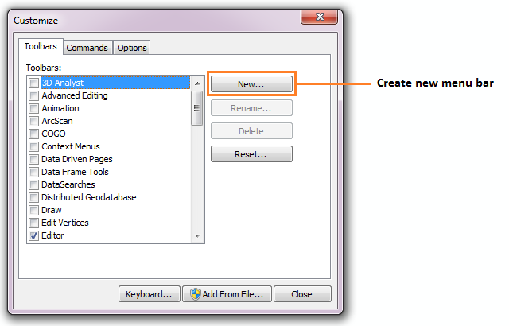
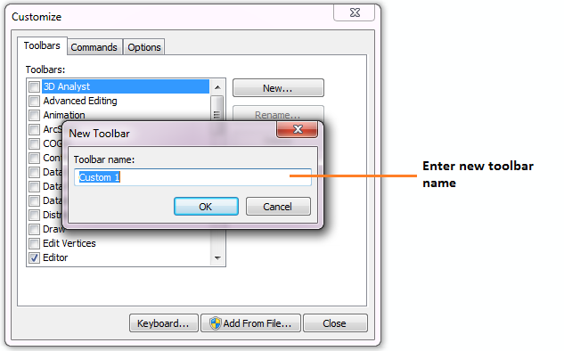

*******************
Setting up the tool
*******************

Before the Data Extractor Tool will function, it needs to be installed and configured. It is recommended that the configuration is carried out first.

.. index::
	single: Configuring the tool

Configuring the tool
====================

The configuration is stored in an XML file called 'DataExtractor.xml', an example of which can be found in the :doc:`appendix <../appendix/appendix>`. Attributes and settings are presented as nodes (beginning with a start node, e.g. ``<example>``, and finishing with an end note, e.g. ``<\example>``), with the value for the setting held between the ``<value>`` and ``<\value>`` tag. 

.. note:: 
	The name of the configuration file must be 'DataExtractor.xml'. The tool will not load if a different name is used.

The XML file can be edited in a text editor such as Notepad or Wordpad, or using a more feature rich XML editor such as as `Sublime Text <https://www.sublimetext.com/3>`_. The configuration file is split into three sections: a section containing general attributes of the searches, and a section that deals with the way each data layer should be handled, split into SQL Server layers and MapInfo layers. 

.. note::
	It is important that the structure of the file is maintained as it is presented in the :doc:`appendix <../appendix/appendix>`. Any changes to the structure may result in the Data Extractor Tool not loading, or not working as expected.

Once editing has been completed and the edits have been saved, it is recommended that the configuration file is opened using an internet browser such as Internet Explorer which will help highlight any editing errors – only if the structure of the file is valid will the whole file be displayed in the internet browser.

.. note::
	It is recommended that the configuration file is kept in a central (network) location, so that all data searches use the same setup. Additionally, it is essential that the configuration file is kept in the same folder as the compiled version of the tool.

.. index::
	single: Setting up the XML file

Setting up the XML file
-----------------------

.. index::
	single: General attributes

**General attributes**

The first section of the configuration file deals with a series of general attributes for the Data Extractor tool. These general nodes specify where files are kept, how output files should be named and other overall settings. Details on these attributes and their expected values are given below. The list follows the order within which the attributes are found in the configuration file. This version of the configuration details is valid for version 1.5.11 of the Data Extractor Tool.

_`LogFilePath` 	
	The folder to be used for storing log files. This folder must already exist.

_`FileDSN`
	The location of the file DSN which specifies the connection to the SQL database.

_`DefaultPath`
	The folder below which all partner folders will be created, and where extracts will be stored.

_`DatabaseSchema`
	The schema used in the SQL database (usually dbo).

_`TableListSQL`
	The SQL statement that is used to return the list of SQL tables which should be included in the user interface for selection by the user.

_`PartnerTable`
	The name of the partner GIS layer in SQL Server used to select the records. The tool expects a MapInfo table of the same name to be present in the map view, which can be added manually by connecting to the the `FileDSN`_ and adding the boundary dataset to the workspace.
 
_`PartnerColumn`
	The column in the `PartnerTable`_ containing the partner name, which is passed to SQL Server by the tool to use as the partner's boundary for selecting the records.

_`ShortColumn`
	The name of the column in the partner GIS layer containing the abbreviated name passed to SQL Server by the tool to use as the sub-folder name for the destination of extracted records. The subfolder is created in the `DefaultPath`_ during extraction if it does not already exist.

_`NotesColumn`
	The name of the column in the partner GIS layer containing any notes text relating to the partner.

_`ActiveColumn`
	The name of the column in the partner GIS layer containing the Y/N flag to indicate if the partner is currently active.  Only active partners will available for processing. The values in this column should be 'Y' or 'N'.

_`FormatColumn`
	The name of the column in the partner GIS layer containing the GIS format required for the output records. The values in the column should be ``Shp``, ``Tab`` or ``Both``.

_`ExportColumn`
	The name of the column in the partner GIS layer indicating whether an export should also be created as a CSV file. The values in this column should be 'Y' or 'N'.

_`FilesColumn`
	The name of the column in the partner GIS layer indicating which map layers should be extracted for each partner. The entry in this column should be a comma-delimited list with no spaces, of the names of the layers (as given in the XML file [REF]) that should be included for each partner.

_`TagsColumn`
	The name of the column in the partner GIS layer indicating which survey tags, if any, should be included in the export. The survey tags should be a comma-delimited list with no spaces.

_`SelectTypeOptions`
	The option list for the selection types, to be included in the 'Selection Type' dropdown box on the interface. This attribute should not be changed. The options are ``Spatial Only`` (records are purely selected on whether they are inside or outside the partner boundary), ``Survey tags only`` (records are purely selected on the survey tags included in the `TagsColumn`_), and ``Spatial and Survey Tags``, where both a spatial intersection and any records with the relevant survey tags are included in the extraction.

_`DefaultSelectType`
	The buffer unit that should be shown by default in the 'Selection Type' dropdown list. This attribute is the index number of the selection type options in the dropdown list, with 1 being the first option.

_`RecMax`
	The maximum number of records what will be extracted in any one partner extract.

_`DefaultZip`
	The default value for zipping the extract files. This attribute should be set to ``Yes`` or ``No``.

_`ConfidentialClause`
	The SQL criteria for excluding any confidential surveys.

_`DefaultConfidential`
	Yes/No attribute, defining whether the check box for 'Extract confidential surveys?' will be set to checked (``Yes``) or unchecked (``No``) when the form is opened. 

_`UTPath`
	The path to the Universal Translator program. The path will usually be ``C:\Program Files (x86)\MapInfo\Professional\UT`` (64 bit operating system) or ``C:\Program Files\MapInfo\Professional\UT`` (32 bit operating system) but it is dependent on the location of the MapInfo installation directory.

_`UTCommand`
	he command to run the Universal Translator program. Unless the program has been renamed, this should be set to ``Imut.exe``.

_`CombinedSitesTableOptions`
	The options that should be shown in the 'Create Combined Sites Table' dropdown list. These options should not be changed.

.. index::
	single: SQL table attributes

**SQL table attributes**

The attributes for any SQL tables to be included in the Data Extractor Tool menu is found within the ``<SQLTables>`` node. For each data layer that can be included in the searches, a new child node is created that has the name of the layer (e.g. ``<AllSpecies>``). This is the same name as should be used in the list of map layers in the `FilesColumn`_ in the partner boundary layer. The actual name of the layer as it is shown in the user interface may be different and is kept in a subsequent child node. A simple example of an SQL layer definition with limited attributes is shown in :numref:`figXMLExample`.

.. _figXMLExample:

.. figure:: figures/DataLayerXMLExample.png
	:align: center

	A simplified example of how data layer attributes are stored in the configuration file. 

The attributes that are required for each SQL table are as follows:

_`TableName`
	The name of the layer as it is held in the SQL database. 

_`Columns`
	A comma-separated list of columns that should be included in the data exported from this data layer during the extraction. The column names are case sensitive and should match the column names in the source table. 

_`Clauses`
	Any SQL clause that should be used to select the data from this table for export. This clause could, for example, ensure records are only included that have been entered after a certain date, are verified or are presence (not absence) records.

_`Symbology`
	The symbology definition for extracts from this table. Multiple symbols can be specified for use in the legend using clauses. Each symbol is specified between ``<Symbol>`` and ``</Symbol>`` tags and is defined by the following child nodes:

	Clause
		The clause that defines the records which will be assigned this symbol.
	Object
		The object that is symbolised using this symbol (e.g. ``Point``)
	Type
		The type of symbol to be used, usually 'Symbol'
	Style
		The style of the symbol to be used. In order to find the syntax for this attribute, set the desired symbol through Options => Symbol style, then write this statement in the MapBasic window and hit enter: ``Print CurrentSymbol()``. Then the full symbol definition (e.g. ``137,255,12, "MapInfo Miscellaneous",256,0``) can be used in this attribute.

.. index::
	single: Map layer attributes

**Map layer attributes**

All map layer attributes are found within the ``<MapTables>`` node. For each data layer that can be included in the searches, a new child node is created that has the name of the layer (e.g. ``<SSSIs>``), in the same way as this is done for the SQL tables. The attributes that are required for each map layer are as follows:

_`TableName`
	The name of the table as it is shown in the MapInfo user interface.

_`Columns`
	A comma-separated list of columns that should be included in the data exported from this data layer during the extraction. The column names are case sensitive and should match the column names in the source table. 

Any exports from map layers will use the same symbology as the source layer.

.. index::
	single: Installing the tool

Installing the tool
===================

.. index::
	single: Installing the tool in ArcGIS

ArcGIS
------

Installing the tool in ArcGIS is straightforward. There are a few different ways it can be installed:

1. Installation through Windows Explorer.
	- Open Windows Explorer and double-click on the ESRI Add-in file for the data searches tool (:numref:`figInstallTool`). 
	- Installation will begin after confirming you wish to install the tool on the dialog that appears (:numref:`figConfirmInstall`). 
	- Once it is installed, it will become available to add to the ArcGIS interface as a button.

.. note::
	In order for this process to work all running ArcMap sessions must be closed. The tool will not install or install incorrectly if there are copies of ArcMap running.

.. _figInstallTool:

	Installing the Data Searches Tool from Windows Explorer. 

.. _figConfirmInstall:

.. figure:: figures/AddInConfirmInstall.png
	:align: center

	Installation begins after clicking 'Install Add-in'. 

2. Another way to install the tool is from within ArcMap: 
	- Firstly, open the Add-In Manager through the Customize menu (:numref:`figOpenAddInManager`). 
	- If the Data Searches Tool is not shown, use the Options tab to add the folder where the tool is kept (:numref:`figAddInOptions`). The security options should be set to the lowest setting as the tool is not digitally signed.
	- Once the tool shows in the Add-In Manager (:numref:`figAddInManager`), it is available to add to the ArcGIS interface as a button.

.. _figOpenAddInManager:

.. figure:: figures/ArcGISStartAddInManager.png
	:align: center

	Starting the ArcGIS Add-In Manager.

.. _figAddInOptions:

.. figure:: figures/ArcGISAddInOptions.png
	:align: center

	The options tab in the ArcGIS Add-In Manager.

.. _figAddInManager:

	The ArcGIS Add-In Manager showing the Data Searches Tool.

In order to add the Data Searches Tool to the user interface, it needs to be added to a toolbar. It is recommended that this is done inside a document that has already been loaded with all the data layers that are required for the tool to run. The tool should then be saved with this document (see `Fundamentals of Saving your Customizations <http://desktop.arcgis.com/en/arcmap/10.3/guide-books/customizing-the-ui/fundamentals-of-saving-your-customizations.htm>`_ for an explanation of how customisations are stored within ArcGIS).

Customising toolbars is done through the Customize dialog, which can be started either through the Add-In Manager (by clicking 'Customize', see :numref:`figAddInManager`), or through choosing the 'Customize Mode...' option in the Customize Menu (:numref:`figCustomizeMode`). Once this dialog is open, ensure that the check box 'Create new toolbars and menus in the document' is checked in the Options tab (:numref:`figCustomizeOptions`).

.. _figCustomizeMode:

.. figure:: figures/ArcGISCustomizeMode.png
	:align: center

	Starting Customize Mode in ArcGIS.

.. _figCustomizeOptions:

	Customising the document in ArcGIS.

It is recommended that the button for the Data Searches Tool is added to a new toolbar. Toolbars are created through the Toolbars tab in the Customize dialog, as shown in figures :numref:`figCustomizeToolbars` and :numref:`figNameToolbar`. Once a new toolbar is created and named, it is automatically added to the ArcMap interface as well as to the Customize dialog (:numref:`figNewToolbar`. In this case the toolbar was named 'TestToolbar'). 

.. _figCustomizeToolbars:

	Adding a new toolbar in ArcGIS

.. _figNameToolbar:

	Naming the new toolbar in ArcGIS.

.. _figNewToolbar:

	New toolbar added to the ArcGIS Interface.

As a final step the Data Searches tool is added to the toolbar. This is done from the Command tab in the Customize dialog (:numref:`figAddInCommands`). Click on Add-In Controls and the Data Searches tool will be shown in the right-hand panel. To add the tool to the toolbar, simply drag and drop it onto it (:numref:`figDragDropTool`). Close the Customize dialog and **save the document**. The Data Searches tool is now ready for its final configuration and first use.

.. _figAddInCommands:

	Finding the Data Searches tool in the add-in commands.

.. _figDragDropTool:

.. figure:: figures/DragAndDropTool.png
	:align: center

	Adding the Data Searches tool to the new toolbar.

In order to function, the tool needs to know the location of the XML configuration file. The first time the tool is run, or whenever the configuration file is moved, a dialog will appear asking for the folder containing the XML file (:numref: `figFirstStart`). Navigate to the folder where the XML file is kept and click OK. If the XML file is present and its structure is correct, the Data Searches form will be shown. Even if the tool is not run at this time, the location of the configuration file will be stored for future use.

.. _figFirstStart:

.. figure:: figures/FirstStart.png
	:align: center

	Locating the configuration file folder.

.. index::
	single: Installing the tool in MapInfo

MapInfo
-------
- Adding the tool
- Running the tool – different version
