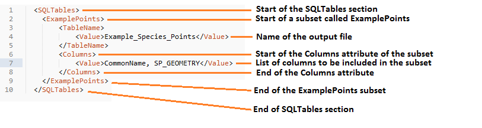
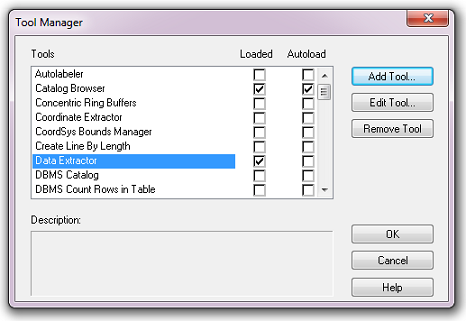

*******************
Setting up the tool
*******************

Before the Data Extractor tool will function, it needs to be installed and configured. It is recommended that the configuration is carried out first.

.. index::
	single: Configuring the tool

Configuring the tool
====================

The configuration is stored in an XML file called 'DataExtractor.xml', an example of which can be found in the :doc:`Appendix <../appendix/appendix>`. Attributes and settings are presented as nodes (beginning with a start node, e.g. ``<example>``, and finishing with an end note, e.g. ``<\example>``), with the value for the setting held between the ``<value>`` and ``<\value>`` tag. 

.. caution:: 
	The name of the configuration file must be 'DataExtractor.xml'. The tool will not load if a different name is used.

The XML file can be edited in a text editor such as Notepad or Wordpad, or using a more feature rich XML editor such as as `Sublime Text <https://www.sublimetext.com/3>`_. The configuration file is split into three sections:

_`General attributes`
	General and default attributes for the tool.

_`SQL Tables`
	Deals with how extracts from each SQL Server table should be handled.

_`Map Tables`
	Deals with how extracts from each GIS layer should be handled.

.. caution::
	It is important that the structure of the file is maintained as it is presented in the :doc:`Appendix <../appendix/appendix>`. Any changes to the structure may result in the Data Extractor tool not loading, or not working as expected.

Once editing has been completed and the edits have been saved, it is recommended that the configuration file is opened using an internet browser such as Internet Explorer which will help highlight any editing errors – only if the structure of the file is valid will the whole file be displayed in the internet browser.

.. note::
	It is recommended that the configuration file is kept in a central (network) location, so that all users use the same configuration. Additionally, it is essential that the configuration file is kept in the same folder as the compiled version of the tool.

.. index::
	single: Special characters in XML

.. raw:: latex

   \newpage

Special characters in XML
-------------------------

The characters ``&``, ``<`` and ``>`` are not valid within values and, so in order to be used, must be **escaped** with XML entities as follows:

<
	This must be escaped with ``&lt;`` entity, since it is assumed to be the beginning of a tag. For example, ``RecYear &lt; 2010``

>
	This should be escaped with ``&gt;`` entity. It is not mandatory -- it depends on the context -- but it is strongly advised to escape it. For example, ``RecYear &gt; 1980``

&
	This must be escaped with ``&amp;`` entity, since it is assumed to be the beginning of a entity reference. For example, ``TaxonGroup = 'Invertebrates - Dragonflies &amp; Damselflies'``

.. index::
	single: General attributes

General attributes
------------------

The first section of the configuration file deals with a series of general attributes for the Data Extractor tool. Each node specifies where files are kept, how output files should be named, where the log file will be saved as well as other overall settings. Details on these attributes (and their typical values where known) are outlined below. The list follows the order within which the attributes are found in the configuration file. This version of the configuration details is valid for the MapInfo version 1.5.11 of the Data Extractor tool.

_`ToolTitle`
	The title to use for the program in the MapInfo Tools menu.

_`LogFilePath` 	
	The folder to be used for storing log files. This folder must already exist.

_`FileDSN`
	The location of the file DSN which specifies the details of the connection to the SQL database.

_`DefaultPath`
	The folder below which all partner folders will be created, and where extracts will be stored.

_`DatabaseSchema`
	The schema used in the SQL database (typically ``dbo``).

_`TableListSQL`
	The SQL statement that is used to return the list of SQL tables which should be included in the user interface for selection by the user.

_`PartnerTable`
	The name of the partner GIS layer (and SQL Server table) used to select records. The tool expects this layer to be present in the active MapInfo workspace and already present in the SQL Server database. A snapshot of a partner table is shown in :numref:`FigPartnerTable`.

.. _FigPartnerTable:

.. figure:: figures/PartnerTable.png
	:align: center

	Example of a partner table loaded into MapInfo

	.. note::
		The partner GIS layer can be uploaded to SQL Server from MapInfo using the 'EasyLoader' tool.
 
_`PartnerColumn`
	The column in the `PartnerTable`_ containing the partner name, which is passed to SQL Server by the tool to use the partner's boundary for selecting the records.

_`ShortColumn`
	The name of the column in the partner GIS layer containing the abbreviated name to use as the sub-folder name for the destination of extracted records. The sub-folder is created in the `DefaultPath`_ during extraction if it does not already exist.

_`NotesColumn`
	The name of the column in the partner GIS layer containing any notes text relating to the partner.

	.. tip::
		Any notes for a partner can be displayed by 'double-clicking' the partner name in the list of partners in the tool interface.

_`ActiveColumn`
	The name of the column in the partner GIS layer containing the Y/N flag to indicate if the partner is currently active.  Only active partners will appear in the tool interface and be available for processing. The values in this column should be ``Y`` or ``N``.

_`FormatColumn`
	The name of the column in the partner GIS layer containing the GIS format required for the output records. The values in the column should be ``Shp``, ``Tab`` or ``Both``.

_`ExportColumn`
	The name of the column in the partner GIS layer indicating whether an export should also be created as a CSV file. The values in this column should be ``Y`` or ``N``.

_`FilesColumn`
	The name of the column in the partner GIS layer indicating which SQL tables and map layers should be extracted for each partner. The entry in this column should be a comma-delimited list of the names of the layers (as defined in the XML file under :ref:`SQLTables <SQLTables>` and :ref:`MapTables <MapTables>`) that should be included for each partner.

_`TagsColumn`
	The name of the column in the partner GIS layer indicating which survey tags, if any, should be included in the export. The survey tags should be a comma-delimited list.

_`SelectTypeOptions`
	The option list for the selection types to be included in the 'Selection Type' drop-down box on the tool interface. This attribute should not be changed. The options are ``Spatial Only`` (records are purely selected on whether they are inside or outside the partner boundary), ``Survey tags only`` (records are purely selected on the survey tags included in the `TagsColumn`_), and ``Spatial and Survey Tags``, where both a spatial intersection and any records with the relevant survey tags are included in the extraction.

	.. note::
		The 'Selection Type' option in the tool interface **only** relates to extracts from SQL tables and **not** to extracts from GIS layers (which are always spatial).

_`DefaultSelectType`
	The selection type that should be shown by default in the 'Selection Type' drop-down list. This attribute is the index number of the selection type options in the drop-down list, with 1 being the first option.

_`RecMax`
	The maximum number of records that will be extracted in any one partner extract.

_`DefaultZip`
	The default value for zipping the extract files. This attribute should be set to ``Yes`` or ``No``.

_`ConfidentialClause`
	The SQL criteria for excluding any confidential surveys. The criteria is appended to any SQL criteria already defined against each file under :ref:`SQLTables <SQLTables>`.

_`DefaultConfidential`
	Yes/No attribute, defining whether the check box for 'Extract confidential surveys?' will be set to checked (``Yes``) or unchecked (``No``) when the form is opened. 

	.. note::
		The 'ConfidentialClause' and 'Extract confidential surveys?' option in the tool interface **only** relates to extracts from SQL tables and **not** to extracts from GIS layers.

_`UTPath`
	The path to the Universal Translator program. The path will usually be ``C:\Program Files (x86)\MapInfo\Professional\UT`` (64 bit operating system) or ``C:\Program Files\MapInfo\Professional\UT`` (32 bit operating system) but it is dependent on the location of the MapInfo installation directory.

_`UTCommand`
	The command to run the Universal Translator program. Unless the program has been renamed, this will usually be ``Imut.exe`` (MapInfo 11.5 or earlier) or ``Fme.exe`` (MapInfo 12 or later).

.. index::
	single: SQL table attributes

SQL table attributes
--------------------

.. _SQLTables:

While the spatial selection that the tool carries out is over the entirety of the SQL table selected by the user, subsets of this data can be written out using the SQL table attributes. The details of these subsets are defined in the ``<SQLTables>`` node.

For each subset that may be included in the extracts a new child node must be created. The node name (e.g. ``<AllSpecies>``) is a user-defined name used to identify an individual subset - the same name should be used in the `FilesColumn`_ in the partner layer to indicate that this subset should be extracted for a partner. A simple example of an SQL layer definition with limited attributes is shown in :numref:`figXMLExample`.

.. _figXMLExample:

	Simplified example of an SQL table subset configuration

The attributes that are required for each SQL table are as follows:

TableName
	The name of the output GIS layer or text file that will be created for this subset.

Columns
	A comma-separated list of columns that should be included in the data exported for this subset during the extraction. The column names (not case sensitive) should match the column names in the source table.

Clauses
	The SQL clause that should be used to select the data for this subset from the SQL table. This clause could, for example, ensure records are only included that have been entered after a certain date, are verified, are presence (not absence) records, or are a subset for particular taxon groups or protected species. Leave this entry blank to export the entire SQL table.

	.. note::
		Clauses specified here must adhere to SQL Server syntax as the clause will be run within SQL Server.

_`Symbology`
	The symbology definition for this subset. Multiple symbols can be specified for use in the symbology using clauses. Each symbol is specified between ``<Symbol>`` and ``</Symbol>`` tags and is defined by the following child nodes:

	Clause
		The clause that defines the records which will be assigned this symbol.
	Object
		The object type that is symbolised using this symbol (e.g. ``Point``)
	Type
		The type of symbol to be used, usually 'Symbol'
	Style
		The style of the symbol to be used.

	.. tip::
		In order to find the syntax for the Style attribute, set the desired symbol through Options => Symbol style, then write the following statement in the MapBasic window and hit enter: ``Print CurrentSymbol()``. Then the full symbol definition (e.g. ``137,255,12, "MapInfo Miscellaneous",256,0``) can be used in this attribute.

.. index::
	single: Map layer attributes

Map table attributes
--------------------

.. _MapTables:

All map layer attributes are found within the ``<MapTables>`` node. For each data layer that can be included in the extractions a new child node must be created. The node name (e.g. ``<SSSIs>``) is a user-defined name used to identify the layer - the same name should be used in the `FilesColumn`_ in the partner layer to indicate that this layer should be extracted for a partner. The attributes that are required for each map layer are as follows:

TableName
	The name of the source GIS layer as it is known in the active MapInfo workspace.

Columns
	A comma-separated list of columns that should be included in the data exported from this GIS layer during the extraction. The column names (not case sensitive) should match the column names in the source GIS layer.

Clause
	The SQL clause that should be used to select the data for this layer from the source GIS layer. Leave this entry blank to export the entire source GIS layer.

	.. note::
		Any clause specified here must adhere to MapInfo SQL syntax as the clause will be run within MapInfo.

Any exports from map layers will use the same symbology as the source layer.

.. raw:: latex

   \newpage

.. index::
	single: Setting up the SQL database

Setting up the SQL Server database
==================================

In addition to any SQL tables containing records to be extracted using the Data Extractor tool, a number of auxiliary tables must also be present in the SQL Server database in order for the tool to be able to extract data from tables held in SQL Server. These are as follows:

_`Survey` table
	The Survey table is a standard table in the Recorder6 database. It is used to identify any records tagged with any survey tags listed in the `TagsColumn`_ column in the partner GIS layer.

_`Spatial_Tables` table
	This table contains information about any SQL data tables that may be used by the tool. The table has the following columns:

	.. tabularcolumns:: |L|L|

	.. table:: Valid date and time format specifiers

		+-----------------+-----------------------------------------------------------------------------------------------+
		|      Column     |                                          Description                                          |
		+=================+===============================================================================================+
		| TableName       | The name of the data table                                                                    |
		+-----------------+-----------------------------------------------------------------------------------------------+
		| OwnerName       | The database owner, usually ``dbo``                                                           |
		+-----------------+-----------------------------------------------------------------------------------------------+
		| XColumn         | The name of the column holding the X coordinates of the record                                |
		+-----------------+-----------------------------------------------------------------------------------------------+
		| YColumn         | The name of the column holding the Y coordinates of the record                                |
		+-----------------+-----------------------------------------------------------------------------------------------+
		| SizeColumn      | The name of the column holding the grid size of the record (in metres)                        |
		+-----------------+-----------------------------------------------------------------------------------------------+
		| IsSpatial       | Bitwise column (1 = Yes, 0 = No) defining whether the table is spatially enabled              |
		+-----------------+-----------------------------------------------------------------------------------------------+
		| SpatialColumn   | If the table is spatially enabled, the name of the geometry column (e.g. ``SP_GEOMETRY``)     |
		+-----------------+-----------------------------------------------------------------------------------------------+
		| SRID            | The name of the spatial reference system used to plot the records                             |
		+-----------------+-----------------------------------------------------------------------------------------------+
		| CoordSystem     | The coordinate system of the spatial data in the table                                        |
		+-----------------+-----------------------------------------------------------------------------------------------+
		| SurveyKeyColumn | The column containing the survey key for each record                                          |
		+-----------------+-----------------------------------------------------------------------------------------------+

	.. note::
		The British National Grid `SRID` value is
		``Earth Projection 8, 79, "m", -2, 49, 0.9996012717, 400000, -100000 Bounds
		(-7845061.1011, -15524202.1641) (8645061.1011, 4470074.53373)``

	.. caution::
		This table must be filled out correctly for each table that is included in the Data Extractor tool.

	.. note::
		A number of stored procedures that are used by the tool for extracting the required records must also be present in the SQL Server database. To obtain copies of these procedures please contact `Hester <mailto:Hester@HesterLyonsConsulting.co.uk>`_ or `Andy <mailto:Andy@AndyFoyConsulting.co.uk>`_.

.. raw:: latex

   \newpage

.. index::
	single: Installing the tool

Installing the tool
===================

To install the tool, make sure that the configuration of the XML file as described above is complete, that the XML file is in the same directory as the tool MapBasic application (.MBX) and that all required GIS layers are loaded in the current workspace. Then, open `Tool Manager` in MapInfo by selecting :kbd:`Tools --> Tool Manager...` in the menu bar (:numref:`figToolManager`). 

.. _figToolManager:

.. figure:: figures/ToolManager.png
	:align: center

	The Tool Manager in MapInfo 12 or earlier

.. raw:: latex

   \newpage

In the `Tool Manager` dialog, click **Add Tool...**, then locate the tool using the browse button **...** on the `Add Tool` dialog (:numref:`figAddTool`). Enter a name in the **Title** box (e.g. 'DataExtractor'), and a description if desired. Then click **Ok** to close the `Add Tool` dialog.

.. _figAddTool:

.. figure:: figures/AddToolDialog.png
	:align: center

	Adding a tool in Tool Manager

.. raw:: latex

   \newpage

The tool will now show in the `Tool Manager` dialog (:numref:`figToolAdded`) and the **Loaded** box will be checked. To load the tool automatically whenever MapInfo is started check the **AutoLoad** box.  Then click **Ok** to close the `Tool Manager` dialog.

.. _figToolAdded:

	The Data Extractor tool is loaded

The tool will now appear as a new entry in the `Tools` menu (:numref:`figToolMenu`).

.. _figToolMenu:

	The Data Extractor tool menu

.. note::
	The name that will appear in the `Tools` menu is dependent on the `ToolTitle`_ value in the configuration file, **not** the name given when adding the tool using the Tool Manager.

.. tip::
	It is recommended that a MapInfo Workspace is created that contains all the required GIS layers to run the tool. Once this workspace has been set up and the tool has been configured and installed, running the Data Extractor tool becomes a simple process.

